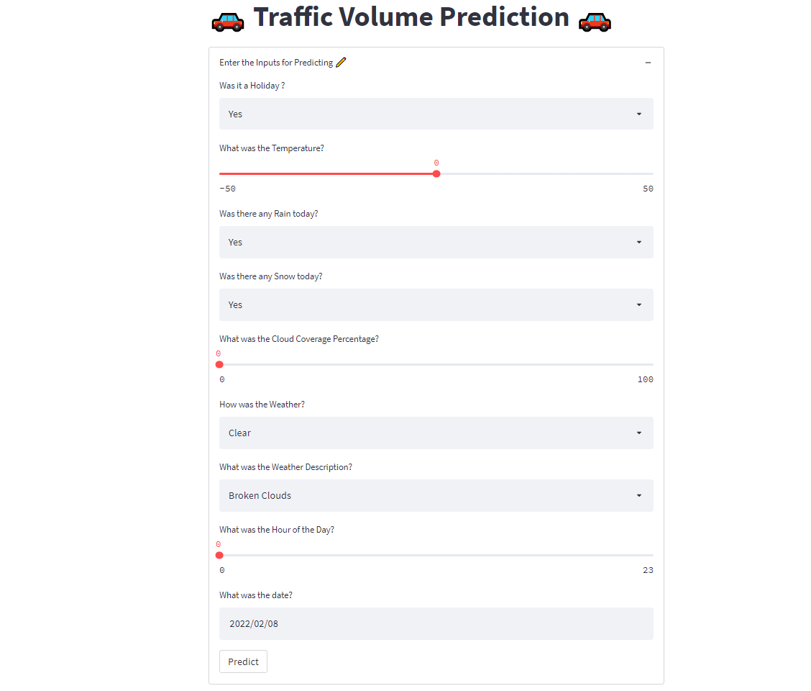

# Hybrid Machine learning Model

- Clone the Repository
- Create a new Directory as assests and download the model from the below link
- [Model Link ](https://drive.google.com/file/d/1-5L83N0PP9GocjC-g_Z9T7Panr3sCEqs/view?usp=sharing)
 
# To Start the Front-End
 - Go to that Directory 
 - Create a Virtual Enviroment 
 Use this code to create and activate (Type in Terminal)
 ```shell 
 $ virtualenv env 
 $ env\Scripts\activate
 ```
Then installl all its requirements
```shell
$ pip install -r requirements.txt
```
Once done you start start your Front-End Server
```shell
$ streamlit run app.py
```
## Now you see your Server

 - http://localhost:8501/
## 🛠 Tech Stack 
- Python
- scikit-learn
- Machine learning Libraries
- streamlit
- Docker 
- Google Cloud Service
# Deployment 

